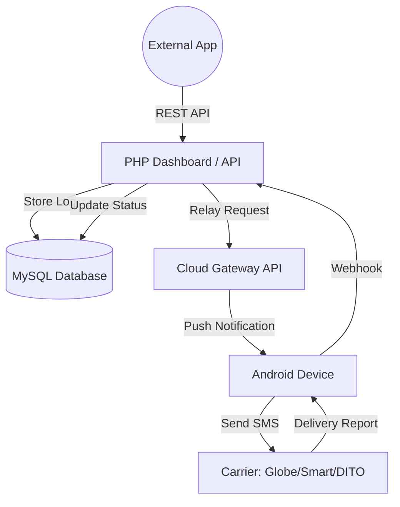

# Learning the SMS Gateway System 🇵🇭

Welcome to the educational guide for the **SMS Gateway & OTP Philippines** project. This document is designed to help you understand the internal mechanics, architecture, and best practices for running a localized SMS gateway.

---

## 🏗 System Architecture

Understanding how the data flows is crucial for debugging and extending the system.

### 1. The PHP Dashboard (Backend)
The "brain" of the operation. It manages API keys, stores message logs, and provides a UI for monitoring. It acts as a middleman between your application and the mobile hardware.

### 2. The Android Application
The "bridge". It runs on a physical Android phone in the Philippines. It listens for commands from the PHP server and utilizes the phone's hardware to send actual cellular SMS messages.

### 3. The Carrier Network
The "final mile". The SMS is sent using local SIM cards, ensuring higher delivery rates and lower costs for domestic (PH) messages.

---

## 📂 Project Structure (MVC)

This project follows the **Model-View-Controller** pattern to keep logic organized and scalable.

| Directory | Purpose |
| :--- | :--- |
| `app/Core` | Core system files: Database connection, Routing, and Base classes. |
| `app/Controllers` | Handles incoming requests and coordinates between Models and Views. |
| `app/Models` | Interacts with the MySQL database (e.g., `SmsLog.php`, `ApiKey.php`). |
| `app/Views` | The UI components and dashboard layouts. |
| `public/` | The web root. All public assets (CSS/JS) and the `index.php` entry point live here. |
| `config/` | Environment and database configuration files. |

---

## 🔑 Core Concepts

### API Authentication
The system uses `X-API-KEY` headers for internal communication.
- **Why?** It decouples your web application's security from the SMS gateway's logic.
- **Persistence:** Keys are stored in the `api_keys` table and should be rotated regularly.

### The Webhook Lifecycle
When you send a message, it doesn't just "finish" once the API responds. It goes through several states:
1. **Pending**: Stored in the database, waiting to be sent to the device.
2. **Sent**: The Android device has successfully handed the message to the carrier.
3. **Delivered**: The recipient's phone has confirmed receipt (if supported by the carrier).
4. **Failed**: Something went wrong (out of load, no signal, invalid number).

---

## 💡 Best Practices for Philippine Carriers

### 1. SIM Card Management
- **Globe/Smart/DITO**: Ensure your SIM has an active "Unli SMS" promo to avoid per-message charges.
- **Expiry**: Keep track of SIM expiry dates. A "Failed" status often means the SIM has expired or is out of load.

### 2. Rate Limiting
Even with "Unlimited" promos, carriers may flag SIMs used for high-frequency automated messaging.
- **Tip**: Introduce a 5-10 second delay between messages if sending in bulk.
- **Tip**: Use multiple devices/SIMs to distribute the load.

### 3. Number Formatting
Always use the local format `09xxxxxxxxx` or the international format `+639xxxxxxxxx`. The system is optimized for these formats.

---

## 🛠 Troubleshooting

- **Messages Stuck in Pending?**
  - Check if the Android app is running and has an active internet connection.
  - Verify `device_id` in your `.env` matches the ID in the app.
- **500 Internal Server Error?**
  - Check `app/Core/Database.php` credentials.
  - Ensure `storage/` directory (if exists) is writable.

---

> [!TIP]
> **Ready to dive deeper?** Check out the [CONTRIBUTING.md](file:///c:/xampp/htdocs/native%20sms/CONTRIBUTING.md) to see how you can help improve this localized gateway!
