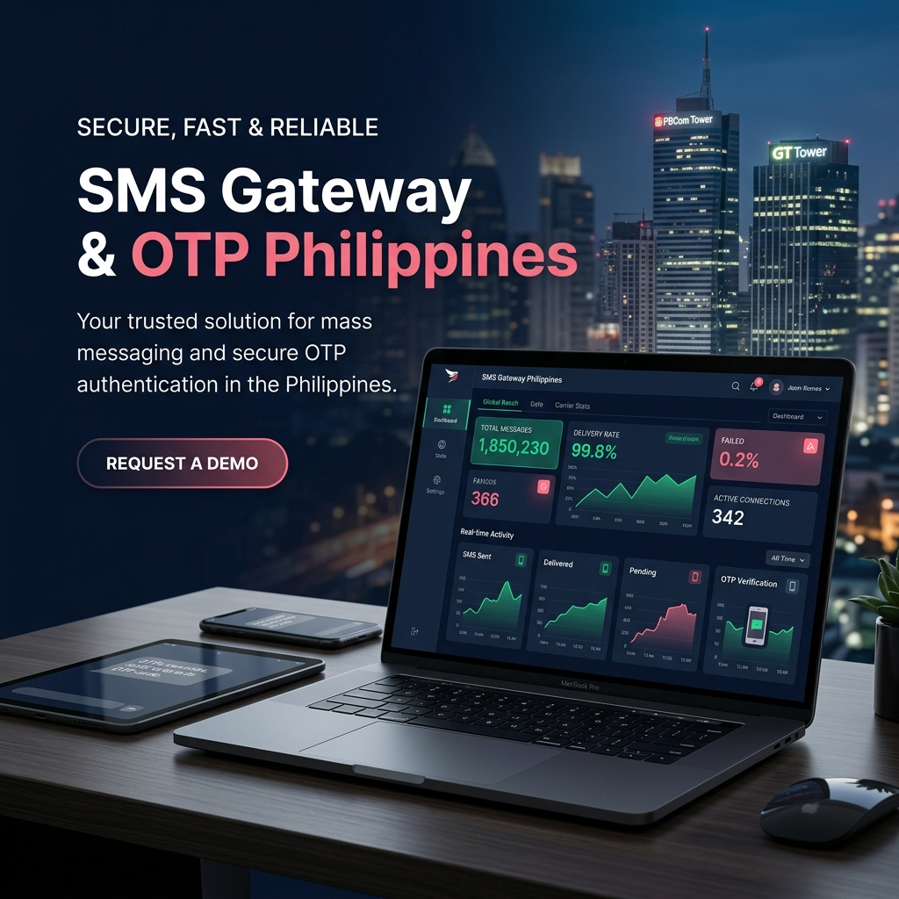
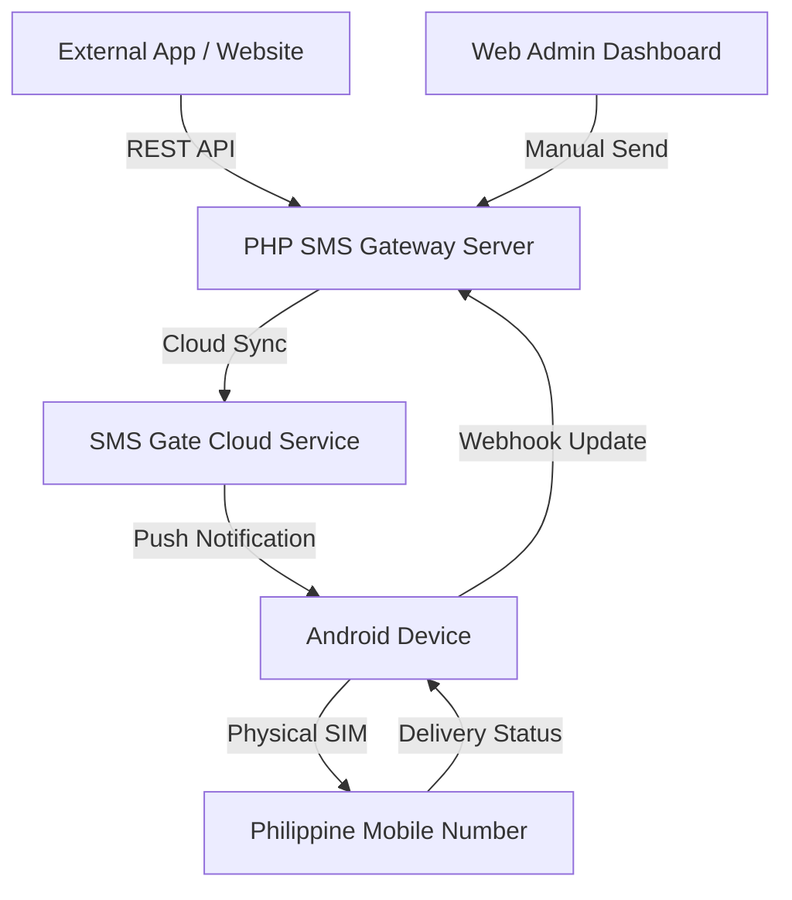

<p align="center">
  
</p>

# 📱 SMS Gateway & OTP Philippines

[](https://php.net)
[](https://opensource.org/licenses/MIT)
[](https://mysql.com)
[](https://en.wikipedia.org/wiki/Telecommunications_in_the_Philippines)

**A high-fidelity, professional-grade SMS Gateway and OTP management system.** Engineered specifically for the Philippine telecommunications landscape, this system enables developers to bridge web applications with physical SIM cards using a centralized Android-to-Cloud architecture.

---

## ✨ Features at a Glance

| Feature | Description |
| :--- | :--- |
| **📊 Intelligent Dashboard** | Real-time telemetry on SMS throughput, success rates, and delivery latencies. |
| **🔐 OTP Engine** | Built-in logic for generating secure, time-sensitive verification codes. |
| **🔌 Universal API** | RESTful endpoints compatible with PHP, Python, Node.js, and more. |
| **📱 Device Mirroring** | Direct integration with the **SMS Gate** Android app for physical SIM sending. |
| **📜 Audit Logs** | Granular history of every message, including carrier-level failure reasons. |
| **🎨 Premium UI** | Dynamic, glassmorphic interface with dark mode support and responsive layouts. |

---

## 🏗️ How It Works (Architecture)



---

## 🚀 Professional Installation Guide

### 📋 Prerequisites
- **Web Server**: Apache / Nginx (PHP 7.4 or 8.x recommended)
- **Database**: MySQL 5.7+ or MariaDB 10.4+
- **Extensions**: `php-curl`, `php-pdo`, `php-mbstring`
- **Android Device**: Running Android 6.0+ with an active SIM card.

### 1️⃣ Clone and Environment Setup
Clone the repository and initialize the security configuration:
```bash
git clone https://github.com/KeithTorda/SMS-GATEWAY-OTP-Philippines.git
cd SMS-GATEWAY-OTP-Philippines
cp .env.example .env
```

### 2️⃣ Configure Environment
Open `.env` and configure your localized settings:
```env
DB_HOST=localhost
DB_NAME=smsgate_db
DB_USER=root
DB_PASS=your_secure_password
APP_URL=https://yourdomain.com/public
APP_NAME="SMS Gateway PH"
```

### 3️⃣ Database Initialization
Create a new database and import the schema:
```bash
mysql -u root -p smsgate_db < config/schema.sql
```

### 4️⃣ Android Hardware Integration
This system is powered by the **SMS Gate** Android solution.
1. Download the app from [sms-gate.app](https://sms-gate.app/).
2. In the app, navigate to **Settings** and retrieve your **API Username**, **API Password**, and **Device ID**.
3. In your Web Dashboard, go to **Settings** and input these values to link your hardware.

---

## 🔌 API Reference

### Send SMS
**Endpoint**: `POST /api/send`

**Request Headers**:
| Header | Value | Description |
| :--- | :--- | :--- |
| `X-API-KEY` | `your_secret_key` | Generated via the Dashboard Settings. |
| `Content-Type` | `application/json` | Required for JSON payloads. |

**Request Body**:
```json
{
    "phone_number": "09123456789",
    "message": "Your verification code is 882910.",
    "sender_name": "MyPHApp",
    "sim_slot": 1
}
```

---

## 🇵🇭 Philippine Network Compatibility
This system has been verified to work with major Philippine carriers:
- **Globe / TM** (Prepaid & Postpaid)
- **Smart / TNT / Sun** (Prepaid & Postpaid)
- **DITO Telecommunity**
- **GOMO**

---

## 🛠️ Troubleshooting

> [!TIP]
> **Check Signal Strength**: If messages are "Pending" but never sent, check the Android device for data connectivity and SIM signal.

> [!WARNING]
> **Webhook Conflicts**: Ensure your `APP_URL` in `.env` is accessible from the public internet (use Ngrok for local testing) to receive delivery status updates.

---

## 📜 License & Credits
- **Developer**: [Keith Torda](https://github.com/KeithTorda)
- **Engine Source**: [SMS Gate](https://sms-gate.app/)
- **License**: Distributed under the MIT License. See `LICENSE` for more information.

---
<p align="center">Made with ❤️ in the Philippines</p>
