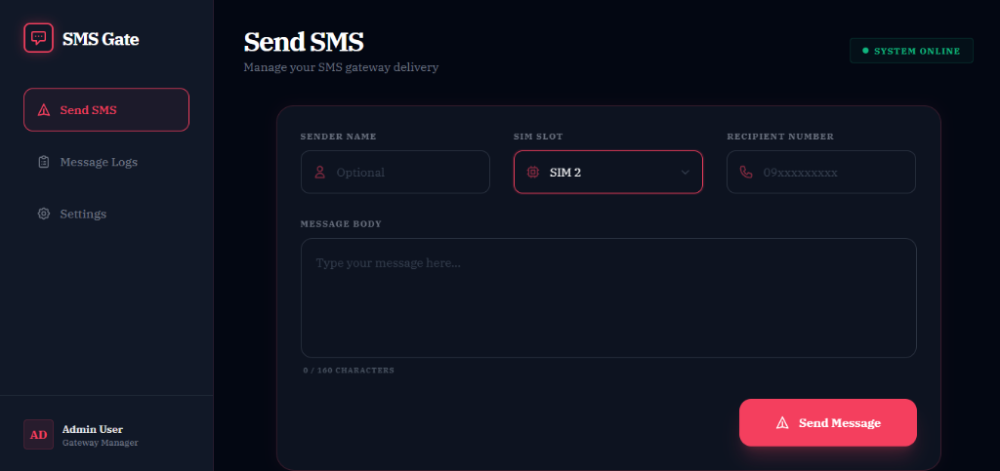
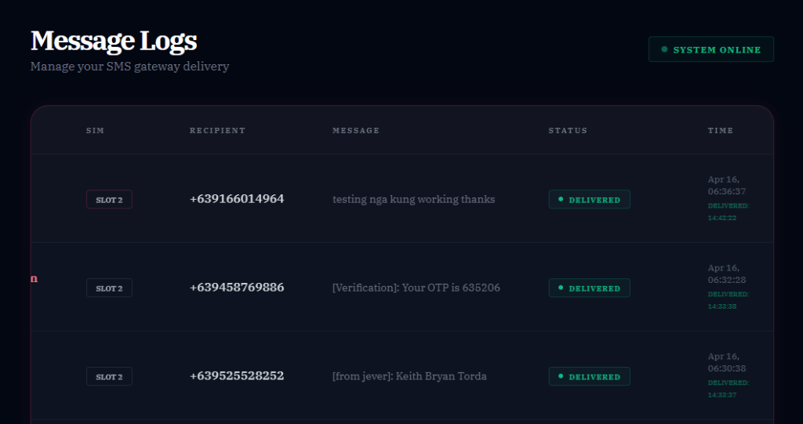
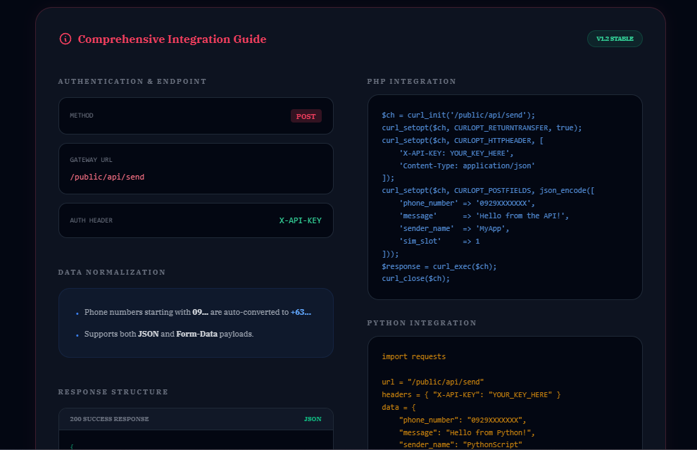

<p align="center">
  
</p>

<div align="center">
  <h2 align="center">SMS Gateway & OTP Philippines</h2>
  <p align="center">
    Turns your smartphone into an SMS gateway for sending and receiving messages via API.
    <br />
    <a href="https://github.com/KeithTorda/SMS-GATEWAY-OTP-Philippines"><strong>Explore the docs »</strong></a>
    <br />
    <br />
    <a href="https://github.com/KeithTorda/SMS-GATEWAY-OTP-Philippines/issues">Report Bug</a>
    ·
    <a href="https://github.com/KeithTorda/SMS-GATEWAY-OTP-Philippines/issues">Request Feature</a>
  </p>
</div>

<details>
  <summary>Table of Contents</summary>
  <ol>
    <li><a href="#about-the-project">About The Project</a></li>
    <li><a href="#features">Features</a></li>
    <li><a href="#ideal-for">Ideal For</a></li>
    <li><a href="#built-with">Built With</a></li>
    <li><a href="#installation">Installation</a></li>
    <li><a href="#prerequisites">Prerequisites</a></li>
    <li><a href="#permissions">Permissions</a></li>
    <li><a href="#getting-started">Getting Started</a></li>
    <li><a href="#webhooks">Webhooks</a></li>
    <li><a href="#roadmap">Roadmap</a></li>
    <li><a href="#contributing">Contributing</a></li>
    <li><a href="#license">License</a></li>
    <li><a href="#contact">Contact</a></li>
    <li><a href="#links">Links</a></li>
  </ol>
</details>

---

## 📸 Preview

````carousel

<!-- slide -->

<!-- slide -->

````

---

## About The Project

This project is a localized PHP implementation of a web dashboard and API gateway designed to work seamlessly with the original **Android SMS Gateway** by [capcom6](https://github.com/capcom6/android-sms-gateway).

It turns your Android smartphone into a professional-grade SMS gateway for the Philippines. This lightweight application allows you to send SMS messages programmatically via a unified API and receive real-time webhooks on your outgoing message status. It is ideal for integrating SMS functionality into your own applications or services using local Philippine SIM cards.

---

## Features

### 📱 Core Functionality
- **🆓 No registration required**: In local mode, you don't need a third-party account.
- **📨 Send and Receive SMS via API**: Use our professional REST API to trigger messages directly.
- **🤖 PHP & MySQL Powered**: Built with a clean MVC architecture for stability and speed.
- **🇵🇭 PH Network Optimized**: Pre-configured for Globe, Smart, DITO, and more.

### 💬 Message Handling
- **📜 Multipart messages**: Supports long messages with auto-partitioning.
- **📊 Real-time Tracking**: Monitor message status (Sent, Delivered, Failed) in the dash.
- **📥 Activity Logger**: View all message history with granular time-stamps.

### 🔒 Security and Privacy
- **🏢 Private Server Support**: Deploy this on your own infrastructure for full data ownership.
- **🔐 API Key Protection**: Generate and revoke keys for external system integrations.

---

## Ideal For
- **🔐 Authentication & Verification**: Secure your PH apps with local SMS-based 2FA.
- **📩 Transactional Messages**: Confirm orders or user actions via text.
- **⏰ SMS Reminders**: Automated appointment or event alerts.
- **📊 User Feedback**: Collect insights via direct SMS interaction.

> [!IMPORTANT]
> **Note**: It is not recommended to use this for batch sending (spamming) due to potential mobile operator restrictions in the Philippines.

---

## Built With
- **Backend**: [PHP 7.4/8.x](https://php.net)
- **Database**: [MySQL / MariaDB](https://mysql.com)
- **UI Framework**: Vanilla CSS & [Tailwind-style modern components]
- **Core Engine**: [Android SMS Gateway](https://github.com/capcom6/android-sms-gateway)

---

## Installation

### Prerequisites
- **Android Device**: Running Android 5.0 (Lollipop) or above.
- **PHP Environment**: Apache/Nginx with PHP 7.4+.
- **Database**: Active MySQL instance.

### Permissions
To use the companion Android application, ensure these permissions are granted:
- `SEND_SMS`: Required to send messages.
- `READ_PHONE_STATE`: Optional (for SIM selection).
- `RECEIVE_SMS`: Optional (for incoming webhooks).

### Installation from APK
1. Download the latest APK from the [capcom6/android-sms-gateway Releases](https://github.com/capcom6/android-sms-gateway/releases).
2. Install the APK on your Android device (Enable "Unknown sources").
3. Configure the app to **Cloud Mode** or **Private Server** mode pointing to your deployed dashboard.

---

## Getting Started

### Local Setup
1. Clone this repository: `git clone https://github.com/KeithTorda/SMS-GATEWAY-OTP-Philippines.git`
2. Create your `.env` file: `cp .env.example .env`
3. Configure your DB and App URL in `.env`.
4. Import `config/schema.sql` to your database.

### API Usage Example (PHP)
```php
curl -X POST -H "X-API-KEY: YOUR_KEY_HERE" \
  -H "Content-Type: application/json" \
  -d '{ "phone_number": "09123456789", "message": "Hello from PH Gateway!" }' \
  https://your-domain.com/api/send
```

---

## Webhooks

The system supports real-time event notifications sent from your device:

| Event | Description |
| :--- | :--- |
| `sms:sent` | Triggered when an SMS message is successfully sent. |
| `sms:delivered` | Triggered when receiving a carrier delivery report. |
| `sms:failed` | Triggered when a message fails to send. |

---

## Roadmap
- [ ] Multi-device account management.
- [ ] Intelligent scheduling for batch alerts.
- [ ] Detailed SIM card analytics.
- [ ] International SMS routing options.

---

## Contributing
Contributions make the open source community amazing! 
1. **Fork** the Project.
2. Create your **Feature Branch**.
3. **Commit** your Changes.
4. **Push** to the Branch.
5. Open a **Pull Request**.

---

## License
Distributed under the **MIT License**. Credits to [capcom6](https://github.com/capcom6) for the original Android implementation.

---

## Contact
**Keith Torda** - [GitHub Profile](https://github.com/KeithTorda)
System Support: [support@sms-gate.app](mailto:support@sms-gate.app)

---

## Links
- **Official Website**: [sms-gate.app](https://sms-gate.app)
- **Source App**: [capcom6/android-sms-gateway](https://github.com/capcom6/android-sms-gateway)
- **Docs**: [docs.sms-gate.app](https://docs.sms-gate.app)

<p align="center">Made with ❤️ in the Philippines</p>
